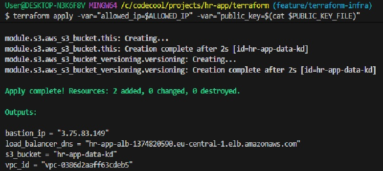
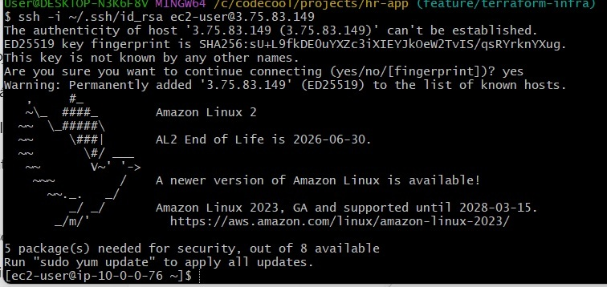
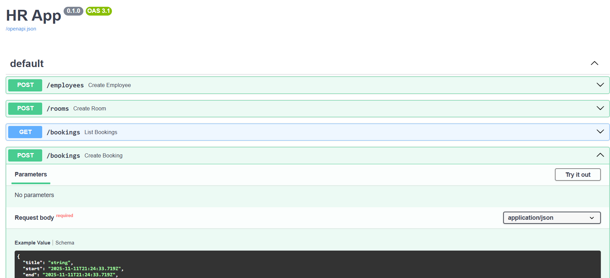

# HR App – Cloud-Based HR Management System

The **HR App** is a modern, cloud-native Human Resources management system built with **FastAPI**, **PostgreSQL**, and **Terraform**.  
It provides a scalable backend API for managing employees, departments, and HR operations, deployed automatically on AWS infrastructure.

### **Backend**
- **Python 3.12+**
- **FastAPI** – high-performance async API framework
- **SQLModel** – ORM built on SQLAlchemy
- **PostgreSQL** – relational database
- **Alembic** – database migrations
- **Uvicorn** – ASGI server

### **Infrastructure**
- **Terraform** – Infrastructure as Code (IaC)
- **AWS** – VPC, EC2, Load Balancer, Security Groups, and S3
- **Bastion Host** – for secure access to private instances

---

Setup and Run the App
1. Clone the repository
git clone https://github.com/<your-username>/hr-app.git
cd hr-app

2. Create a Python virtual environment
python -m venv venv
source venv/Scripts/activate    # for Git Bash or WSL on Windows

3. Install dependencies
pip install -r requirements.txt

4. Run the app
uvicorn app.main:app --reload

Visit the API Docs

Swagger UI: http://127.0.0.1:8000/docs

ReDoc UI: http://127.0.0.1:8000/redoc

## Screenshots
###Terraform infrastructure created:

###Login to bastion host:

###The running app:

3.Destroy infrastructure
terraform destroy -var="allowed_ip=$ALLOWED_IP" -var="public_key=$(cat ~/.ssh/id_rsa.pub)"

Testing the App
Once the app is running locally:
curl http://127.0.0.1:8000/docs
